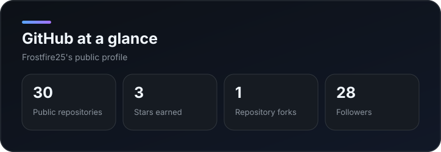
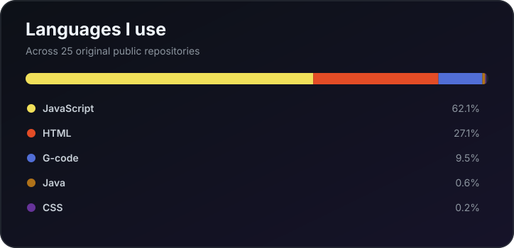
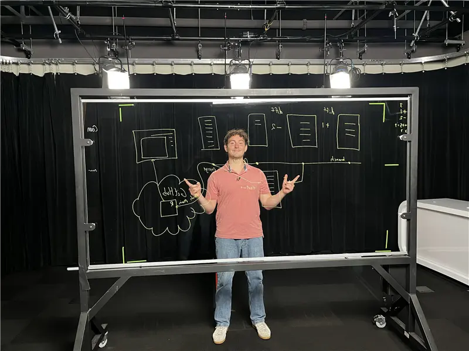

# Hi, I'm Alex Elguezabal

I'm a Software Engineer at **Microsoft**, working with Microsoft 365 Enterprise Cloud
Trusted Platforms and based in **Seattle/Redmond, WA**.

I enjoy building **resilient systems**, **clean architectures**, and **intuitive user
experiences**, with an emphasis on scalability, performance, and good developer
ergonomics.

## Student Demo Series

Curious about what students are building with technology? Explore practical demos,
learn from other creators, and find inspiration in the
**[Student Demo Series](https://aka.ms/student-demo-series-website)**.

## What I'm working toward

- Building systems that are **observable**, **fault-tolerant**, and easy to operate
- Collaborating through **good design docs**, **clear ownership**, and **iterative delivery**
- Learning more about DevOps/SRE, backend systems, emerging tech, AI/ML, and personal finance

## Experience

- **Software Engineer, Microsoft** — Aug 2025 to Present
- **SRE Intern, Oracle** — May 2023 to Aug 2023
- **Student Developer, Merrimack College**

## GitHub snapshot

These cards are generated from GitHub's public API and stored in this repository, so
they do not depend on an external image service.

## Connect

- [LinkedIn](https://www.linkedin.com/in/alex-elguezabal/)
- [GitHub](https://github.com/Frostfire25)

  
<strong>A few fun facts</strong>

- Rugby player
- Skier
- Amateur chef
- Curious about electronic music and emerging tech trends
- Always happy to connect with builders, creators, and lifelong learners

---

  

  Keep learning, building, and sharing with the <a href="https://aka.ms/student-demo-series-website">Student Demo Series</a>.

